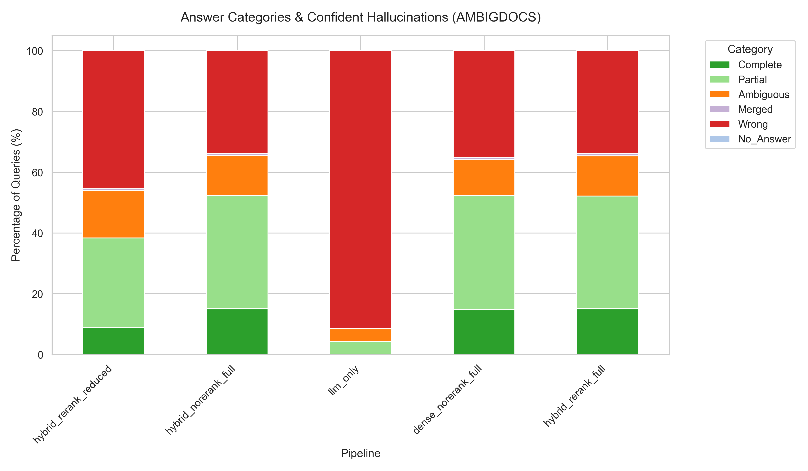

# Baseline RAG Systems for Contamination-Aware Evaluation

**PRD 1 — Baseline RAG Systems and Benchmark Harness**

A reproducible baseline RAG evaluation stack that runs multiple standard baseline systems across multiple benchmark types, saving all intermediate artifacts for downstream contamination analysis.

---

## Cluster Setup (Princeton HPC / SLURM)

Compute nodes have no internet. Before submitting any SLURM job you must
pre-cache models and datasets on a **login node**:

```bash
# Step 1 — Download retrieval + reranking models (fixes offline bge error)
bash slurm/precache_models.sh

# Step 2 — Download benchmark datasets
bash slurm/precache_datasets.sh

# Step 3 — Submit jobs
sbatch slurm/run_baselines.sh
```

📖 Full cluster guide (env setup, Qwen download, smoke-check, troubleshooting):
[docs/cluster-setup.md](docs/cluster-setup.md)

---

## Quick Start

### 1. Environment Setup

```bash
# Requires Python 3.11
python -m venv .venv
source .venv/bin/activate
pip install -e ".[dev]"
```

### 2. Run Tests

```bash
# All unit + integration tests (no GPU / model download required)
pytest tests/ -m "not slow" -q

# Full suite including model-dependent tests
pytest tests/ -q
```

### 3. Run a Baseline (Dry Run)

```bash
python -m rag_baseline.cli --config configs/baselines/vanilla_rag.yaml --dry-run
```

### 4. Run a Baseline (Full)

Requires a running vLLM server:

```bash
# Start vLLM (in a separate terminal)
python -m vllm.entrypoints.openai.api_server \
    --model Qwen/Qwen2.5-32B-Instruct \
    --port 8000

# Run baseline
python -m rag_baseline.cli --config configs/baselines/hybrid_rerank.yaml
```

---

## Baseline System Matrix

| Baseline | Retriever | Reranker | Context | Config |
|----------|-----------|----------|---------|--------|
| **0 — LLM-only** | none | off | none | `llm_only.yaml` |
| **A — Vanilla RAG** | dense | off | full | `vanilla_rag.yaml` |
| **B — Hybrid RAG** | hybrid | off | full | `hybrid_rag.yaml` |
| **C — Hybrid + Reranker** | hybrid | on | full | `hybrid_rerank.yaml` |
| **D — Reduced Context** | hybrid | on | reduced | `reduced_context.yaml` |

All configs are in `configs/baselines/`.

---

## Benchmark Ladder

| Tier | Dataset | HuggingFace ID | Purpose |
|------|---------|---------------|---------|
| 0 | NQ-Open | `google-research-datasets/nq_open` | Sanity factual QA |
| 1 | AmbigDocs | `yoonsanglee/AmbigDocs` | Core ambiguity QA |
| 2 | FaithEval | `Salesforce/FaithEval-*-v1.0` | Context faithfulness |
| 3 | RAMDocs | `HanNight/RAMDocs` | Mixed conflict stress test |

### FaithEval Subtasks

FaithEval comprises three separate subtasks:
- **Unanswerable** — context lacks answer (expect "unknown")
- **Inconsistent** — context is self-contradictory (expect "conflict")
- **Counterfactual** — context presents wrong facts (test faithfulness)

---

## Project Structure

```
src/rag_baseline/
├── adapters/          # Dataset adapters (NQ, AmbigDocs, FaithEval, RAMDocs)
├── config/            # RunConfig schema + YAML loading
├── context/           # Deterministic context assembly
├── evaluation/        # EM, multi-answer, dataset-specific scorers
├── generation/        # vLLM generator + mock for testing
├── inspection/        # Qualitative inspection pack export
├── logging/           # Structured JSONL artifact logging
├── parsing/           # Output parser (single/multi/unknown modes)
├── pipeline/          # End-to-end pipeline runner
├── prompts/           # Prompt templates (families A/B/C)
├── reranking/         # Cross-encoder reranker
├── retrieval/         # Dense, sparse, hybrid retrieval
├── schemas/           # Pydantic schemas (input → evaluation)
└── cli.py             # Config-driven CLI entrypoint

configs/baselines/     # 5 pre-built baseline YAML configs
tests/
├── unit/              # 210+ unit tests
└── integration/       # End-to-end pipeline tests
```

---

## Running Specific Datasets

### NQ-Open (Tier 0)
```bash
python -m rag_baseline.cli --config configs/baselines/hybrid_rerank.yaml --max-examples 100
```

### AmbigDocs (Tier 1)
Edit config to set `dataset: ambigdocs`, or create a new YAML:
```yaml
dataset: ambigdocs
split: validation
retriever_type: hybrid
reranker_enabled: true
# ...
```

### FaithEval (Tier 2)
```yaml
dataset: faitheval
split: test
retriever_type: none          # FaithEval bundles its own context
context_strategy: full
answer_mode: single_answer
```

### RAMDocs (Tier 3)
```yaml
dataset: ramdocs
split: test
retriever_type: none          # RAMDocs bundles its own documents
context_strategy: full
answer_mode: multi_answer
```

---

## Evaluation Modes

| Dataset | Answer Mode | Metric | Unknown Support |
|---------|------------|--------|----------------|
| NQ-Open | `single_answer` | Normalized EM | No |
| AmbigDocs | `multi_answer` | Multi-answer recall/F1 | No |
| FaithEval | `single_answer` | EM (per subtask) | Yes |
| RAMDocs | `multi_answer` | Multi-answer recall/F1 | Yes |

---

## Qualitative Inspection

Export a ≥25-example inspection pack from run artifacts:

```python
from rag_baseline.inspection.qualitative import (
    sample_inspection_pack,
    export_inspection_pack,
)

# artifacts = list of run artifact dicts (from JSONL logs)
pack = sample_inspection_pack(artifacts, min_total=25, seed=42)
export_inspection_pack(pack, "outputs/inspection_pack.jsonl")
```

This produces:
- `inspection_pack.jsonl` — one example per line with question, prediction, gold, category
- `inspection_summary.json` — counts per category

---

## Configuration Reference

All configs use `RunConfig` (see `src/rag_baseline/config/schema.py`):

| Field | Type | Description |
|-------|------|-------------|
| `dataset` | str | Dataset name (nq_open, ambigdocs, faitheval, ramdocs) |
| `split` | str | HuggingFace split (train, validation, test) |
| `retriever_type` | str | dense, sparse, hybrid, none |
| `reranker_enabled` | bool | Enable cross-encoder reranking |
| `generator_model` | str | Model ID for vLLM |
| `prompt_family` | str | Prompt family (A, B, C) |
| `top_k_retrieval` | int | Number of passages to retrieve |
| `top_k_after_rerank` | int | Passages after reranking |
| `context_strategy` | str | full, reduced, none |
| `answer_mode` | str | single_answer, multi_answer |
| `output_dir` | str | Output directory for artifacts |
| `random_seed` | int | Seed for reproducibility |

---

## Architecture: Controller Insertion Point

The pipeline follows a clean separation:

```
Input → Retrieval → [Reranking] → Context Assembly → Prompt → Generation → Parse → Evaluate
```

A future contamination-aware controller can be inserted between **Reranking** and **Context Assembly** to filter, score, or reweight passages before they enter the prompt.

---

## Test Coverage

| Module | Tests |
|--------|-------|
| Schemas (6 modules) | 26 |
| Config | 12 |
| Retrieval | 10 (+4 slow) |
| Reranking | 3 (+2 slow) |
| Context Assembly | 8 |
| Prompts | 7 |
| Output Parser | 9 |
| Evaluation | 13 |
| Artifact Logger | 8 |
| Pipeline Runner | 5 |
| NQ + AmbigDocs Adapters | 26 |
| FaithEval Adapter | 34 |
| RAMDocs Adapter | 21 |
| Inspection Pack | 15 |
| CLI + Configs | 9 |
| Integration | 5 |
| **Total** | **210+ GREEN** |

---

## AmbigDocs Error Analysis

### Baseline Results: Answer Category Breakdown



The chart above breaks down answer outcomes across all five baseline pipelines. Key findings:

**LLM-only is nearly always wrong for multi-answer questions.**
Without retrieval, the model produces roughly 92% "Wrong" answers on AmbigDocs — it either returns a single answer for a multi-sense question or returns a confidently wrong referent. Only ~4% of responses are even partially correct.

**RAG dramatically reduces outright wrong answers — but partial recall dominates.**
All four RAG variants drop the "Wrong" fraction from ~92% to ~33–36%. The dominant outcome shifts to "Partial" (~37–40%), meaning the model finds and returns *some* correct answers but consistently misses others. This is the core failure mode this project targets.

**Complete recall plateaus at ~15% regardless of retrieval strategy.**
Hybrid + reranking (`hybrid_rerank_full`) achieves the highest complete recall at ~16%, and dense + hybrid variants cluster tightly at 14–15%. Additional retrieval sophistication (reranking, reduced context) yields marginal gains. This ceiling suggests that incomplete retrieval coverage — not reranking quality — is the binding constraint.

**"Ambiguous" and "Merged" categories are small but meaningful.**
Cross-entity blending and single-answer collapse together account for ~10–13% of RAG outputs and likely reflect cases where retrieved passages for multiple referents are present but the model conflates them rather than separating them.

### What We Are Doing Next

The plateau at ~15% complete recall under all current baselines exposes two distinct failure modes that require separate fixes:

1. **Retrieval-limited failures (~29.5% of errors):** The retrieved set simply does not cover all valid referents. The model cannot recover even in principle. Fix: contamination-aware re-ranking or query expansion that explicitly targets entity disambiguation.

2. **Post-retrieval failures (~70.5% of errors):** Evidence is present but not fully used — either through single-answer collapse, omission of supported answers, or entity blending. Fix: a contamination-aware context controller that restructures or gates the context before it enters the prompt, combined with a multi-answer extraction constraint.

**Next step** is a human error review pass using `human_checks/index.html` to validate the heuristic-based categorization above, identify the precise split between retrieval-limited and post-retrieval cases, and collect labelled examples for few-shot prompt design for PRD 3 (the contamination-aware controller).

To start the review dashboard:
```bash
# Serve from the repo root so relative paths resolve automatically
python -m http.server 8080
# Open http://localhost:8080/human_checks/
```

The dashboard auto-loads three files on open — no drag-and-drop needed:
1. `human_checks/ambigdocs_stratified_error_samples.jsonl` — the 20 stratified error examples
2. `outputs/hybrid_rerank/retrievals.jsonl` — full passage text for each example
3. `outputs/hybrid_rerank/prompts.jsonl` — prompts shown in the collapsible prompt panel

If the server isn't available (e.g. opening as a local file), you can still drop files manually onto the left sidebar.

---

## License

Research use only. See individual dataset licenses for benchmark data.
