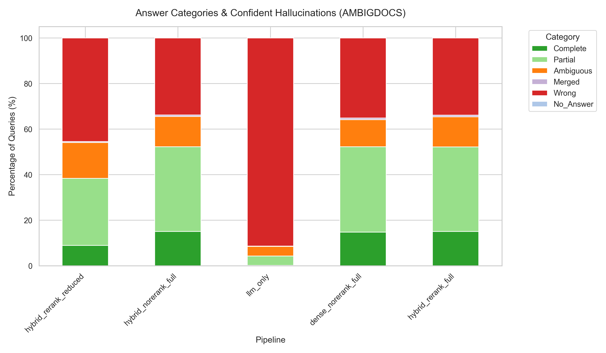

# Contamination-Aware Control for Retrieval-Augmented Generation

> **Research project** — Python 3.11 · Qwen2.5-32B · Princeton HPC

A research project investigating a specific and underappreciated failure mode in RAG systems: *retrieved evidence that is individually relevant but collectively misleading*. Standard RAG pipelines treat retrieval quality as the main lever for improving generation. This project tests the hypothesis that **what happens to the retrieved set before it enters the prompt** is equally important — and that a modular contamination-aware controller inserted between retrieval and generation can materially reduce confident hallucinations without sacrificing utility on clean evidence.

---

## Current Status

> **PRD 1 (baseline harness) — complete. PRD 2 (error review dashboard) — complete. PRDs 3–4 (controller + evaluation) — not started.**

| Stage | What it is | Status |
|-------|-----------|--------|
| **PRD 1** — Baseline harness | Five standard RAG variants, four benchmark datasets, full artifact logging, 210+ tests | ✅ Done |
| **PRD 2** — Error review dashboard | Browser-based annotation tool for stratified AmbigDocs errors; human-verified failure taxonomy | ✅ Done |
| **PRD 3** — Contamination controller | Contamination scoring, minimal-consistent-subset selection, abstention routing | 🔲 Not started |
| **PRD 4** — Evaluation and paper artifacts | Ablations, metric suite, submission-quality tables | 🔲 Not started |

The baselines are run on real hardware (Princeton HPC, Qwen2.5-32B) and produce real numbers. The controller they are designed to precede does not exist yet.

---

## The Problem

RAG systems fail in two qualitatively distinct ways that current pipelines do not distinguish:

1. **Retrieval-limited failure** — the retrieved set simply does not contain the right evidence. The model cannot recover. No controller helps here; better retrieval is needed.

2. **Post-retrieval contamination failure** — evidence is present in the retrieved set, but the set as a whole is misleading: passages for multiple referents are mixed together, contradictory claims coexist, or partial-match lures anchor the model on the wrong entity. The model produces a confident, coherent, wrong answer.

The second failure mode is the target of this project. It is different from hallucination in the absence of evidence — the model is actively *using* retrieved material, just the wrong parts of it.

### Why This Matters for Safety

Confident hallucinations in RAG are particularly dangerous in high-stakes retrieval settings (medical QA, legal document review, knowledge-base question answering) because the model's output *looks* grounded — it can cite passages — even when it has merged incompatible evidence or latched onto a same-name entity. Standard faithfulness metrics do not catch this because they only check whether the output is entailed by *some* passage in the context, not whether the passages themselves form a coherent evidentiary set.

A contamination-aware controller that detects these conditions and either selects a minimal coherent subset or triggers calibrated abstention is a safety mechanism, not just an accuracy improvement.

---

## Key Baseline Finding

All five standard baselines plateau at roughly 16% complete recall on AmbigDocs regardless of retrieval strategy. Adding reranking or reducing context yields only marginal gains. The dominant failure mode is not missing evidence — 70.5% of failures occur when evidence *is present* but the model collapses it into a partial or merged answer.



| Pipeline | Complete | Partial | Ambiguous | Merged | Wrong |
|----------|----------|---------|-----------|--------|-------|
| LLM-only | 0.2% | 4.2% | 4.2% | 0.2% | 91.2% |
| Dense (no rerank) | 14.8% | 37.2% | 12.0% | 0.8% | 35.1% |
| Hybrid (no rerank) | 15.0% | 37.2% | 13.2% | 0.7% | 33.9% |
| Hybrid + rerank | **16.8%** | 38.0% | 10.5% | 0.9% | **33.9%** |
| Hybrid + rerank (reduced ctx) | 14.0% | 41.5% | 7.9% | 0.4% | 36.2% |

Multi-answer recall score (hybrid + rerank): **38.9%** on AmbigDocs, **71.4%** on RAMDocs.

---

## Approach

The proposed architecture inserts a **contamination-aware controller** at a single well-defined point in the existing pipeline:

```
Input
  -> Retriever
  -> [Reranker]
  -> [CONTROLLER]  <-- insertion point
      |-- score retrieved set for contamination
      |-- select minimal internally-consistent subset
      +-- route: full-context / subset / abstain
  -> Context Assembly
  -> Prompt
  -> Generator
  -> Parse
  -> Evaluate
```

The controller is designed to be stack-agnostic, auditable (every routing decision carries a reason code), and ablation-friendly. The three routing outcomes allow clean measurement of which component contributes: contamination detection alone, subset selection alone, or both combined.

### Contamination Taxonomy

The project distinguishes three operationally distinct contamination subtypes:

- **T1 — Distractor contamination**: passages share surface terms with the query but push toward the wrong answer.
- **T2 — Entity ambiguity**: retrieved set mixes evidence about different referents with the same name.
- **T3 — Conflict contamination**: passages contain directly contradictory claims about the same entity or event.

A fourth dimension — **retrieval instability** — captures cases where the answer changes materially under small perturbations to the top-k set, even when a gold passage is present.

---

## What Is in This Repo

### Done

- **Five baseline RAG systems** running on Qwen2.5-32B via vLLM, fully config-driven and reproducible from YAML.
- **Four benchmark datasets** with dataset-specific adapters and evaluation modes: NQ-Open (factual QA), AmbigDocs (ambiguity), FaithEval (faithfulness under unanswerable / inconsistent / counterfactual context), RAMDocs (mixed conflict stress test).
- **Structured artifact logging** at every stage: retrieval, reranking, prompt construction, generation, parsing, evaluation. All artifacts are JSONL and can be replayed or analyzed offline.
- **Human error review dashboard** (`human_checks/index.html`) — a single-file browser app for annotating stratified AmbigDocs error samples, with keyboard navigation, LocalStorage persistence, and CSV/JSON export.
- **210+ tests** (unit + integration), all green, no GPU required for the fast suite.

### Not Done

- The contamination-aware controller (PRD 3) — no code exists yet.
- Contamination scoring, subset selection, abstention routing — all planned.
- The controlled benchmark slice with matched clean / contaminated / missing-evidence conditions (PRD 2 controlled benchmark) — planned.
- Formal evaluation campaign and paper artifacts (PRD 4) — planned.

---

## Repository Structure

```
src/rag_baseline/
|-- adapters/       # Dataset adapters: NQ-Open, AmbigDocs, FaithEval, RAMDocs
|-- analysis/       # Plot generation scripts (run results -> PNG/CSV)
|-- config/         # RunConfig schema + YAML loader
|-- context/        # Deterministic context assembly
|-- evaluation/     # EM, multi-answer recall/F1, dataset-specific dispatchers
|-- generation/     # vLLM generator + MockGenerator for testing
|-- inspection/     # Qualitative inspection pack export (>=25 examples)
|-- logging/        # Structured JSONL artifact logger
|-- parsing/        # Output parser: single-answer, multi-answer, unknown modes
|-- pipeline/       # End-to-end pipeline runner (3-pass CPU/GPU/CPU design)
|-- prompts/        # Prompt templates: families A (single), B (multi), C (unknown)
|-- reranking/      # Cross-encoder reranker (bge-reranker-v2-m3)
|-- retrieval/      # Dense (bge-base-en), sparse (BM25), hybrid, factory
|-- schemas/        # Pydantic v2 schemas: InputExample -> EvaluationOutput
+-- cli.py          # Config-driven CLI entrypoint

configs/baselines/  # 5 pre-built YAML configs (one per baseline system)
tests/
|-- unit/           # 205 unit tests -- no GPU, no network
+-- integration/    # 5 end-to-end pipeline tests
human_checks/       # Error review dashboard + stratified sample data
analysis_plots/     # Generated figures and aggregated_metrics.csv
outputs/            # Per-run artifacts (gitignored except structure)
```

---

## Baseline System Matrix

| ID | Name | Retriever | Reranker | Context | Config |
|----|------|-----------|----------|---------|--------|
| **0** | LLM-only | none | — | none | `llm_only.yaml` |
| **A** | Vanilla RAG | dense | off | full top-10 | `vanilla_rag.yaml` |
| **B** | Hybrid RAG | BM25 + dense | off | full top-10 | `hybrid_rag.yaml` |
| **C** | Hybrid + Reranker | BM25 + dense | cross-encoder | full top-5 | `hybrid_rerank.yaml` |
| **D** | Reduced Context | BM25 + dense | cross-encoder | top-2 only | `reduced_context.yaml` |

Model: `Qwen/Qwen2.5-32B-Instruct` · Retrieval: `BAAI/bge-base-en-v1.5` · Reranker: `BAAI/bge-reranker-v2-m3`

---

## Benchmark Ladder

| Tier | Dataset | HuggingFace ID | Task | Answer Mode |
|------|---------|----------------|------|-------------|
| 0 | NQ-Open | `google-research-datasets/nq_open` | Factual sanity check | single |
| 1 | AmbigDocs | `yoonsanglee/AmbigDocs` | Same-name entity disambiguation | multi |
| 2 | FaithEval | `Salesforce/FaithEval-*-v1.0` | Faithfulness under bad context | single + unknown |
| 3 | RAMDocs | `HanNight/RAMDocs` | Mixed ambiguity + misinformation + noise | multi + unknown |

FaithEval has three subtasks: **unanswerable** (context omits answer), **inconsistent** (context self-contradicts), **counterfactual** (context states wrong facts).

---

## Quick Start

### Environment

```bash
# Python 3.11 required
python -m venv .venv
source .venv/bin/activate   # Windows: .venv\Scripts\activate
pip install -e ".[dev]"
```

### Tests (no GPU needed)

```bash
# Fast suite -- unit + integration, no model downloads
pytest tests/ -m "not slow" -q

# Full suite including retrieval model tests
pytest tests/ -q
```

### Dry run (validates config, no generation)

```bash
python -m rag_baseline.cli \
    --config configs/baselines/vanilla_rag.yaml \
    --dry-run
```

### Full run (requires vLLM server)

```bash
# Terminal 1 -- start the LLM server
python -m vllm.entrypoints.openai.api_server \
    --model Qwen/Qwen2.5-32B-Instruct \
    --port 8000

# Terminal 2 -- run the strong baseline
python -m rag_baseline.cli \
    --config configs/baselines/hybrid_rerank.yaml
```

Artifacts are written to `outputs/hybrid_rerank/`: `inputs.jsonl`, `retrievals.jsonl`, `prompts.jsonl`, `predictions.jsonl`, `evaluations.jsonl`, `summary_metrics.json`.

---

## Configuration Reference

Configs live in `configs/baselines/`. All fields map to `RunConfig` (`src/rag_baseline/config/schema.py`):

| Field | Type | Values |
|-------|------|--------|
| `dataset` | str | `nq_open` · `ambigdocs` · `faitheval` · `ramdocs` |
| `split` | str | `train` · `validation` · `test` |
| `retriever_type` | str | `dense` · `sparse` · `hybrid` · `none` |
| `reranker_enabled` | bool | `true` / `false` |
| `generator_model` | str | any vLLM-compatible model ID |
| `prompt_family` | str | `A` (single) · `B` (multi) · `C` (unknown) |
| `top_k_retrieval` | int | passages fetched before rerank |
| `top_k_after_rerank` | int | passages after rerank |
| `context_strategy` | str | `full` · `reduced` · `none` |
| `answer_mode` | str | `single_answer` · `multi_answer` |
| `output_dir` | str | path for all run artifacts |
| `random_seed` | int | reproducibility seed |

---

## Evaluation Modes

| Dataset | Metric | Unknown Output |
|---------|--------|---------------|
| NQ-Open | Normalized exact match | No |
| AmbigDocs | Multi-answer recall + F1 | No |
| FaithEval | Exact match per subtask | Yes (`unknown` / `conflict`) |
| RAMDocs | Multi-answer recall + F1 | Yes |

---

## Error Review Dashboard

The `human_checks/` dashboard is a single-file browser app for annotating stratified AmbigDocs error samples:

```bash
# Serve from repo root so relative paths resolve
python -m http.server 8080
# Then open: http://localhost:8080/human_checks/
```

The dashboard auto-loads on open:

1. `human_checks/ambigdocs_stratified_error_samples.jsonl` — 20 stratified error examples
2. `outputs/hybrid_rerank/retrievals.jsonl` — full retrieved passage text
3. `outputs/hybrid_rerank/prompts.jsonl` — prompts shown in the collapsible panel

Annotations persist in LocalStorage and can be exported as JSON or CSV.

---

## Cluster Setup (Princeton HPC / SLURM)

Compute nodes have no internet access. Pre-cache everything on a login node first:

```bash
# 1 -- Download retrieval + reranking models
bash slurm/precache_models.sh

# 2 -- Download benchmark datasets
bash slurm/precache_datasets.sh

# 3 -- Submit baseline jobs
sbatch slurm/run_baselines.sh
```

Full guide (environment setup, Qwen download, smoke-check, troubleshooting): [docs/cluster-setup.md](docs/cluster-setup.md)

---

## Test Coverage

| Module | Tests |
|--------|-------|
| Schemas (6 modules) | 26 |
| Config | 12 |
| Retrieval | 10 (+4 slow) |
| Reranking | 3 (+2 slow) |
| Context Assembly | 8 |
| Prompts | 7 |
| Output Parser | 9 |
| Evaluation | 13 |
| Artifact Logger | 8 |
| Pipeline Runner | 5 |
| NQ + AmbigDocs Adapters | 26 |
| FaithEval Adapter | 34 |
| RAMDocs Adapter | 21 |
| Inspection Pack | 15 |
| CLI + Configs | 9 |
| Integration | 5 |
| **Total** | **210+ GREEN** |

---

## Qualitative Inspection

Export a stratified inspection pack from any run's artifacts:

```python
from rag_baseline.inspection.qualitative import (
    export_inspection_pack,
    sample_inspection_pack,
)

# artifacts: list of dicts loaded from a run's evaluations.jsonl
pack = sample_inspection_pack(artifacts, min_total=25, seed=42)
export_inspection_pack(pack, "outputs/inspection_pack.jsonl")
```

Produces `inspection_pack.jsonl` (one example per line: question, prediction, gold, category) and `inspection_summary.json` (counts per category).

---

## Related Work

This project is directly motivated by several recent benchmarks and findings:

- **AmbigDocs** — entity disambiguation under same-name ambiguity; the primary Tier 1 benchmark here.
- **FaithEval** (ICLR 2025, Salesforce) — faithfulness under unanswerable / inconsistent / counterfactual context.
- **RAMDocs / MADAM-RAG** (2025) — mixed ambiguity + misinformation + noise in a single retrieved set.
- **WikiContradict** (NeurIPS 2024 D&B) — contradictory Wikipedia passages as a first-class evaluation condition.
- **BAR-RAG** (2026) — brittleness under retrieval noise even when gold evidence is present in top-k.
- **CONFLICTBANK** (NeurIPS 2024 D&B) — knowledge conflicts as a hallucination cause, including same-name entity conflicts.

The contamination controller design is motivated by the gap identified across this literature: while reranking and compression improve individual passage relevance, no standard component explicitly models *whether the retrieved set as a whole forms a coherent evidentiary basis*.

---

## License

Research use only. See individual dataset licenses for benchmark data.