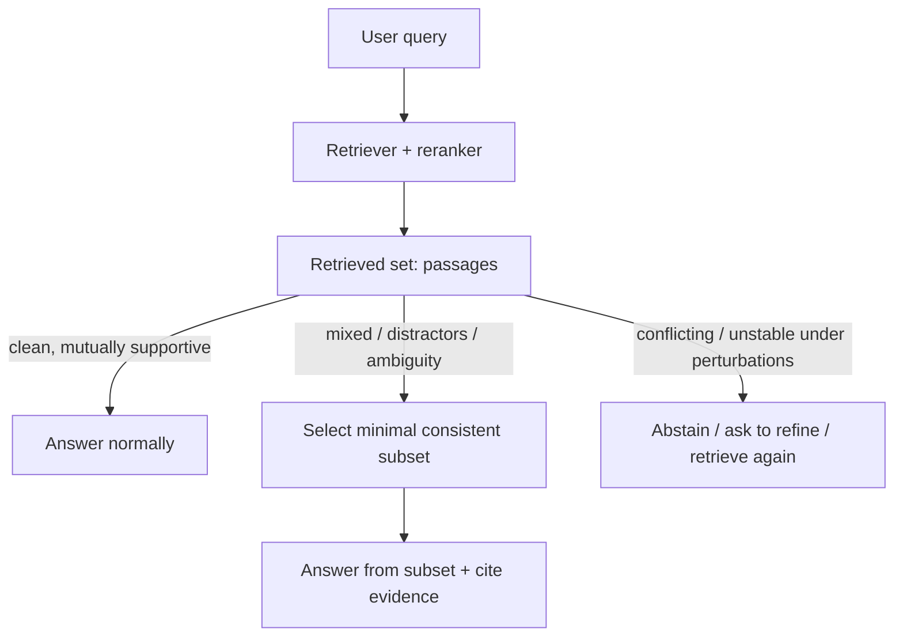
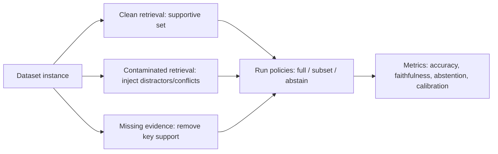

# Evidence Contamination in Modern RAG Systems

## Executive summary

Evidence contamination—retrieval sets that look relevant but contain *mixed*, semantically similar, partially conflicting, or lure-like passages that induce confident wrong synthesis—is a recognized and increasingly studied failure mode in retrieval-augmented generation (RAG), although the field uses multiple overlapping names (e.g., *context noise*, *distractor passages*, *knowledge conflicts*, *inconsistent context*, *ambiguous entities*, *retrieval permutation sensitivity*). citeturn13view0turn7search24turn13view3turn27view3

Academic work provides direct experimental evidence that (a) adding semantically related-but-non-supporting passages (distractors) can *reduce answer accuracy* or increase hallucinations even when relevant evidence exists, and (b) contradictory/ambiguous context can lead models to merge incompatible facts rather than represent uncertainty or conflict. citeturn27view0turn22search0turn13view3turn27view3turn15view0

Practical documentation from major builders of RAG stacks (platform guides and framework docs) also flags that superficially relevant or excessive irrelevant context can drown out key evidence and push models toward plausible but incorrect answers, motivating reranking, filtering/compression, and stronger evaluation. citeturn9view3turn25view3turn25view0turn25view1

Mitigations in the literature and in practice cluster into: (1) retrieval precision improvements (hybrid search, metadata filters, reranking, contextual embeddings), (2) post-retrieval filtering/compression and evidence selection (including entailment/NLI-style checks), (3) faithfulness/conflict checks or conflict-aware reasoning, and (4) abstention/selective answering and calibration under insufficient/unstable context. citeturn27view0turn18view0turn9view2turn23search11turn25view1

A key gap remains: while many methods improve relevance or detect faithfulness failures, fewer works operationalize *retrieval-set “semantic stability”* as a modular *control layer* that (i) detects contamination, (ii) selects a minimal internally consistent evidence subset, and (iii) triggers abstention when no stable subset exists—especially in a way that is lightweight, auditable, and stack-agnostic. (There is adjacent prior art in minimal-evidence identification for verification, but it has not fully converged into a standard RAG “contamination controller” pattern.) citeturn2search3turn27view0turn15view0turn23search1

## Conceptual framing and operational mapping

### A concrete operational definition aligned to current terminology

Your “contamination” concept decomposes cleanly into three operational families that already appear (sometimes implicitly) in modern RAG research and evaluation:

**Distractor contamination (semantic lure / partial match)**: retrieved passages share surface terms or semantic neighborhood with the query, but *do not* support the correct answer and can actively distract the generator. Framework documentation describes this as “superficially relevant” chunks yielding “confident but factually wrong” answers, and research formalizes this as a “distracting effect” of passages. citeturn25view0turn13view0turn27view0

**Conflict contamination (inter-context contradiction, misinformation, drift)**: retrieved passages support *competing answers* or contain real-world contradictions; the model often fails to explicitly represent conflict and instead outputs a single confident synthesis. This is central to benchmarks built around contradictory passages and “inconsistent context.” citeturn13view3turn23search11turn16view1turn23search6

**Ambiguity / entity confusion (partial-match lure via same-name entities)**: retrieval returns mixed evidence about different entities with the same name; models may merge attributes across entities. This directly matches your “entity confusion” contamination subtype. citeturn27view3turn15view0turn16view2

A fourth, increasingly relevant dimension is **instability under perturbation** (order/top‑k/chunking): the answer changes substantially when you permute or slightly alter the retrieved set, even if a “gold” item is present. This aligns with your “semantic instability under small perturbations” criterion. citeturn14view0turn9view3turn23search1

### Relationship to common RAG taxonomies

Recent review-style taxonomies (especially those focused on hallucinations in RAG) often separate *retrieval-stage problems* from *generation-stage deficiencies*, and explicitly include “context noise” and “context conflict” as generation-time issues when the model is presented with problematic context. citeturn2search5turn7search24

Your framing tightens this by emphasizing that (a) retrieval can return **relevant-looking** but adversarially misleading mixtures and (b) the generator’s synthesis behavior under mixture is a primary risk target—not merely “missing evidence.” This is compatible with (and extends) “how the model behaves if retrieval goes wrong” lines of work that motivate retrieval-quality evaluation and conditional policies. citeturn18view0turn9view3turn9view2

The control-layer branching shown above mirrors how “retrieval quality evaluators” and “selective generation/abstention” are motivated in recent work, but your contribution is to center the decision on *semantic stability / contamination of the retrieved set* rather than only sufficiency or generic relevance. citeturn18view0turn9view2turn14view0

image_group{"layout":"carousel","aspect_ratio":"16:9","query":["retrieval augmented generation diagram","RAG pipeline document retrieval reranking generation illustration","evidence grounding in RAG diagram"],"num_per_query":1}

## Academic evidence that contamination is a current RAG problem

### Evidence that “more retrieval can make answers worse” via distractors

Multiple papers explicitly report that retrieval augmentation can *reduce* accuracy when retrieved context is noisy or contains distracting passages, and propose methods that either train robustness or filter context.

* **“Making Retrieval-Augmented Language Models Robust to Irrelevant Context”** frames “misuse of irrelevant evidence” as causing cascading errors, analyzes cases where retrieval reduces accuracy, and proposes (among other ideas) an NLI-based filter for passages that do not entail a question–answer pair. citeturn27view0  
* **“The Distracting Effect: Understanding Irrelevant Passages in RAG”** states that it is a “well-known issue” that irrelevant passages can distract the answer-generating model and cause incorrect responses, and it introduces a quantifiable measure of a passage’s distracting effect across LLMs. citeturn13view0turn19search3  
* **“The Power of Noise: Redefining Retrieval for RAG Systems”** reports counterintuitive findings: highly scored but non-relevant documents can hurt RAG effectiveness, and injecting random documents can sometimes improve accuracy (reported up to large gains), emphasizing that “relevance” as defined by retrievers is not equivalent to “useful for generation.” citeturn22search0turn27view1  
* **BAR-RAG (2026)** argues that RAG systems remain brittle under realistic retrieval noise *even when the required evidence appears in the top‑K results*, attributing failures partly to relevance-only optimization that selects evidence unsuitable for the generator. citeturn23search1turn14view0  
* **ReflectiveRAG (industry-track 2026)** similarly describes sharp degradation under extreme noise and motivates adaptive, evidence-sufficiency-aware loops rather than fixed top‑k heuristics. citeturn22search17turn23search4  

Taken together, this line strongly supports your thesis that a failure mode exists where “evidence is present but contaminated by distractors,” and that the generator’s *integration* under mixture is a core problem, not just retrieval recall. citeturn22search0turn14view0turn23search1turn13view0

### Evidence for conflicting retrieved passages and “knowledge conflict” as a first-class research topic

A second cluster focuses on contradictions and conflicts across context sources:

* **WikiContradict (NeurIPS 2024 D&B)** explicitly targets “knowledge conflicts arising from different augmented retrieved passages,” constructs a benchmark of contradictory Wikipedia passages, and reports that models struggle to correctly handle and express conflict—especially for implicit conflicts that require reasoning. citeturn13view3turn7search12  
* **FaithEval (ICLR 2025)** includes an “inconsistent context” task designed to simulate retrieval surfacing contradictory or fabricated information, and reports that even strong models often struggle to remain faithful to the given context. citeturn23search11turn27view2  
* **RAMDocs / MADAM-RAG (2025)** explicitly models realistic retrieval settings where ambiguous queries, misinformation, and noise co-occur; it positions “conflicting information from multiple sources” as a practical reality and shows that this combined setting is substantially harder than treating ambiguity or misinformation alone. citeturn15view0turn15view1turn19search9  
* **CONFLICTBANK (NeurIPS 2024 D&B)** frames “knowledge conflicts” as a major source of hallucinations, and includes conflict causes aligned with your definition: misinformation, temporal discrepancies, and semantic divergences (including “same name, different person” style semantic conflicts). citeturn16view1turn16view2  
* **AionRAG (2026)** highlights a concrete real-world conflict mechanism in dynamic corpora: semantically relevant retrieval mixing multiple historical versions of a claim (temporal conflict) that the model fails to resolve toward the query-time-valid version. citeturn23search6turn23search2  

This literature supports “conflicting retrieved passages” as a recognized phenomenon, with dedicated benchmarks and system proposals, and it matches your aim to treat contamination as more than “missing evidence.” citeturn13view3turn23search11turn15view0turn16view1turn23search6

### Evidence for entity confusion and partial-match lures

Entity confusion has been directly operationalized as a benchmarked ability:

* **AmbigDocs (2024)** uses Wikipedia disambiguation pages to create sets of documents about distinct entities sharing a name; it reports that state-of-the-art models often produce ambiguous answers or incorrectly merge information across entities. citeturn27view3turn19search0  
* CONFLICTBANK’s semantic conflict examples include swapped-entity cases (same surface name describing a different person), aligning with your “wrong person/organization” contamination subtype. citeturn16view2turn16view1  
* RAMDocs explicitly includes “ambiguity” as a co-factor with misinformation/noise and uses AmbigDocs as a component benchmark for ambiguous queries. citeturn15view0turn19search5  

### Instability under perturbations as a contamination signature

A particularly direct match to your “stability under small perturbations” idea:

* **Stable-RAG (2026)** reports that, under top‑5 retrieval *with the gold document included (and fixed at first position)*, answers can vary substantially across permutations of the retrieved set—i.e., the model’s behavior is sensitive to retrieval-order perturbations in ways that can induce hallucinations. citeturn14view0  

This is strong evidence that “contamination” is not only “wrong docs were retrieved,” but also “the retrieved set’s composition and ordering can destabilize synthesis even when correct evidence is present.” citeturn14view0turn23search1turn9view3

### RAG hallucinations “despite grounding” and the need for better instrumentation

Benchmarks and detection work show that hallucination under RAG includes both baseless additions and contradictions relative to context:

* **RAGTruth (2024)** builds a corpus of ~18k RAG responses with fine-grained annotations and distinguishes hallucinations that introduce baseless information from those that conflict with the provided context, emphasizing that RAG does not eliminate contradictory/unsupported claims. citeturn17view0turn17view1turn7search1  
* **ReDeEP (OpenReview)** frames a key practical difficulty as detecting hallucinations that conflict with retrieved content even when retrieved content itself is “accurate and relevant,” implying a need to model how LLMs balance parametric vs external evidence. citeturn6search28  

These support your “auditable control layer” motivation: the community is actively building tools and datasets to *measure* when a model contradicts or invents beyond evidence, but the specific “contaminated evidence set induces wrong synthesis” axis is still less standardized as a first-class evaluation dimension than generic relevance/faithfulness. citeturn17view0turn6search28turn6search2turn6search1

### Comparison table of key academic sources

| Work (year) | Contamination-aligned phenomenon | Evidence presented | Primary datasets/setting | Mitigation direction | Notable limitations for your project |
|---|---|---|---|---|---|
| Retrieval-Augmented Generation (2020) | RAG as grounding; hallucination remains a limitation | Foundational architecture; also notes inability to easily provide insight/update and risk of hallucinations in general | Wikipedia-centric retrieval-augmented QA | Architectural RAG scaffold | Not focused on mixed-evidence contamination as defined here citeturn24search0turn24search1 |
| Making RALMs Robust to Irrelevant Context (2023/2024) | Retrieval can reduce accuracy via irrelevant context | Empirical analysis across QA benchmarks; proposes NLI filtering + robustness training | Open-domain QA benchmarks | Passage filtering (NLI entailment) + robustness training | Core mitigation partly relies on training; NLI filter can discard useful evidence citeturn27view0 |
| The Power of Noise (2024) | High-scoring non-relevant docs can hurt; noise sometimes helps | Controlled manipulation of doc types/position/number; reports detriment from “related” distractors and counterintuitive noise effects | Natural Questions-style open QA setup | Rethink retrieval objective; analyze doc selection/placement | Results complicate “more filtering always better”; need to translate into actionable control criteria citeturn22search0turn27view1 |
| Corrective Retrieval Augmented Generation (2024) | “How does the model behave if retrieval goes wrong?” | Proposes retrieval evaluator that triggers different actions; filters irrelevant info via decompose–recompose | 4 datasets (short + long-form) | Retrieval-quality gating + corrective retrieval + filtering | Focus is retrieval quality broadly; not explicitly minimal consistent subset under conflicts citeturn18view0 |
| WikiContradict (2024) | Inter-context conflict from contradictory retrieved passages | Benchmark; reports models struggle when given two contradictory passages | 253 instances of contradictory Wikipedia passages | Evaluation + prompts/metrics for conflict handling | Small benchmark; conflict type is Wikipedia-based and may not cover enterprise ambiguity/noise citeturn13view3turn7search12 |
| CONFLICTBANK (2024) | Knowledge conflicts (misinfo, temporal, semantic divergence) | Very large benchmark; explicit taxonomy and construction pipeline | 7.45M claim–evidence pairs; 553k QA pairs | Benchmarking + analysis of conflict causes | Not RAG-only; some conflicts are synthetic/constructed; mapping to retrieved top‑k mixtures needs care citeturn16view1turn16view2 |
| AmbigDocs (2024) | Entity confusion & merged answers across same-name entities | Benchmark; reports models merge facts across entities | Wikipedia disambiguation-based docs/questions | Evaluation + answer-type ontology | Targets ambiguity; not necessarily distractors/conflicts from retrieval scoring errors citeturn27view3turn19search0 |
| FaithEval (2024/2025) | Faithfulness under unanswerable/inconsistent/counterfactual context | Benchmark; reports models struggle to stay faithful; “inconsistent context” simulates contradictory retrieval | 4.9K contextual QA problems | Faithfulness evaluation; model comparisons | Not specific to retrieval pipelines; but directly models the downstream “bad context” regime citeturn27view2turn23search11 |
| RAGTruth (2024) | Hallucinations under RAG including conflict with context | Large annotated corpus; distinguishes conflict vs baseless | ~18k RAG responses across tasks | Detection + evaluation of detectors | Does not isolate “contaminated evidence set” as causal factor; more about annotation/detection citeturn17view0turn17view1 |
| The Distracting Effect (2025) | Semantically related irrelevant passages mislead generator | Defines “distracting effect”; methods to find hard distractors; training improves accuracy | RAG QA settings with distractor mining | Identify hard distractors; robustness fine-tuning | Strong on distractors; less directly about *conflicting* evidence subsets and abstention policies citeturn13view0turn19search3 |
| RAMDocs / MADAM-RAG (2025) | Combined ambiguity + misinformation + noise in retrieved docs | New dataset; shows combined setting is harder; multi-agent debate discards noise/misinfo | AmbigDocs, FaithEval inconsistent subset, RAMDocs | Multi-agent debate + aggregator | Debating is heavier than a “lightweight control layer”; may be costly for production baselines citeturn15view0turn15view1turn19search9 |
| Stable-RAG (2026) | Retrieval-permutation-induced hallucination | Shows substantial variation across permutations even with gold doc fixed first | 3 QA datasets | Multi-order generation + clustering hidden states | Computationally heavier; but provides a clean “instability” diagnostic signature citeturn14view0 |
| AionRAG (2026) | Temporal conflict via mixed historical versions | Reports failure under knowledge drift; motivates time-correct retrieval/control | Dynamic corpora / revision settings | Time-aware control of retrieval/generation | Preprint status; domain/time assumptions need validation across benchmarks citeturn23search6turn23search2 |
| BAR-RAG (2026) | Brittleness under noise even when evidence is in top‑K | Claims failures arise from relevance-only selection; focuses on evidence “suitability” | Knowledge-intensive QA | Evidence selection optimized for generator boundary | Uses RL/fine-tuning components; your modular/no-retrain goal may prefer inference-time approximations citeturn23search1turn23search9 |

## Industry and system reports documenting similar failure modes

### Official platform guidance and framework documentation

Across official guidance, a recurring theme is “similarity ≠ usefulness,” and *irrelevant or excessive* retrieved content can actively produce incorrect answers:

* OpenAI’s guidance on optimizing accuracy describes retrieval failure modes including supplying wrong context or *too much irrelevant context* that “drowns out” key information and leads to hallucinations, and it explicitly frames RAG evaluation as having a retrieval axis (noise/relevance) and an LLM axis (behavior given context). citeturn9view3  
* Microsoft’s Foundry RAG documentation lists as a known limitation that if retrieval returns irrelevant or incomplete passages, the model can still produce incomplete or inaccurate answers “despite grounding.” citeturn25view3  
* Microsoft’s Azure Databricks vector search retrieval quality guide emphasizes measurement-driven tuning and frames retrieval failures as causing incorrect answers/hallucinations; it recommends hybrid search, filtering, and reranking as high-impact levers. citeturn26view2turn26view3  
* entity["company","LlamaIndex","rag framework"]’s failure mode checklist explicitly describes “retrieval hallucination” where chunks look superficially relevant but don’t contain the answer and the model hallucinates a plausible response from irrelevant context; it recommends reranking, hybrid search, and relevance thresholds. citeturn25view0  
* entity["company","LangChain","llm app framework"]’s “contextual compression” post states that retrieved documents often contain both relevant and irrelevant text; inserting irrelevant information is “bad” because it can distract the model and consume context budget, motivating post-retrieval compression/filtering abstractions. citeturn25view1  

These are practical confirmations that the “contaminated evidence set” pattern causes *confident wrong answers* in real RAG pipelines, motivating exactly the kind of post-retrieval control logic you propose. citeturn9view3turn25view3turn25view0turn25view1

### Vendor techniques that implicitly target contamination

Although vendor posts often describe the issue as “noise” or “irrelevant passages,” the recommended techniques align with contamination control:

* entity["company","Pinecone","vector database"]’s engineering guidance on cascading retrieval states that reranking helps ensure only the most relevant information is passed to downstream LLMs and explicitly motivates reranking as reducing noise and hallucinations (and token usage). citeturn26view0  
* entity["company","Weaviate","vector database"]’s advanced RAG techniques highlight that metadata filtering can reduce irrelevant results (“noise”) by narrowing the search space (e.g., filtering by age/date/version constraints), explicitly framing it as improving relevance. citeturn26view1  

### Reports that are relevant but point to adjacent axes (not contamination per se)

Some high-quality industry research emphasizes insufficiency and abstention, which complements contamination but is not identical:

* Google Research’s “sufficient context” framing aims to separate errors caused by insufficient context vs model misuse, and proposes selective generation that combines a sufficiency signal with confidence to improve abstention trade-offs. citeturn9view2turn5academia31  
* Anthropic’s contextual retrieval work focuses on retrieval *failures due to context loss in encoding* and presents substantial retrieval accuracy improvements (especially with reranking). It supports the general claim that retrieval quality is central but does not primarily study conflicting-evidence contamination. citeturn25view2  

### Comparison table of practical sources

| Source type | What it documents that matches “contamination” | Suggested mitigations | Evidence strength |
|---|---|---|---|
| OpenAI platform guidance | Wrong context or too much irrelevant context can cause hallucinations; retrieval noise as a first-class axis to optimize | Retrieval tuning, reduce noise, evaluation grid | High (official guidance + explicit failure mode description) citeturn9view3 |
| Microsoft Foundry RAG docs | Irrelevant/incomplete passages can yield inaccurate answers despite grounding | Content prep + retrieval configuration + prompt + filtering/ranking | High (official docs + explicit limitation) citeturn25view3 |
| Microsoft Databricks retrieval quality guide | Emphasizes evaluation; missing key context causes hallucination; recommends hybrid search, filtering, reranking | Hybrid search, metadata filtering, reranking, evaluation harness | Medium–High (official doc; focuses more on quality than conflict) citeturn26view2 |
| LlamaIndex failure mode checklist | “Superficially relevant” chunks cause confident wrong answers (“retrieval hallucination”) | Reranking, hybrid search, relevance thresholds | Medium–High (framework doc + concrete symptoms/fixes) citeturn25view0 |
| LangChain contextual compression | Retrieved docs contain irrelevant text; irrelevant text distracts and wastes context | Post-retrieval compression/filter pipelines | Medium–High (framework blog + explicit rationale) citeturn25view1 |
| Pinecone reranking guidance | Reranking reduces noise and helps minimize hallucinations | Cross-encoder / hosted rerankers | Medium (vendor blog; plausible but not a controlled RAG study) citeturn26view0 |
| Weaviate advanced RAG | Filtering reduces “noise” via metadata constraints | Metadata filtering, hybrid retrieval | Medium (vendor blog; primarily prescriptive) citeturn26view1 |

## Failure modes matching your contamination definition and how mitigations map

### Topically similar but conflicting passages

**What’s documented:** Benchmarks explicitly provide contradictory retrieved passages (or “inconsistent context”) and find that LLMs frequently fail to (a) detect conflict, (b) represent uncertainty, or (c) appropriately abstain. citeturn13view3turn27view2turn23search11

**Mitigations observed:** conflict-aware reasoning/evaluation; conflict modeling; debate/aggregation; and selective answering policies that avoid single confident synthesis when conflict is detected. citeturn15view0turn23search11turn19search1

**Does it address contamination specifically?** Partially. Many methods treat conflicts as a special dataset condition rather than a general “retrieval stability” signal. Your control-layer framing (score + policy) can unify these. citeturn13view3turn15view0turn14view0

### Entity confusion and partial-match lures

**What’s documented:** Under ambiguous same-name entities, models often merge facts across entities (a direct match to your lure intrusion analogy). citeturn27view3turn19search0

**Mitigations observed:** entity-aware disambiguation and answer ontologies; retrieval constraints/metadata; and multi-answer outputs for ambiguity rather than forced single answers. citeturn27view3turn15view0turn26view1

**Does it address contamination specifically?** Often yes for ambiguity, but not always as a *post-retrieval* modular controller; many approaches embed disambiguation into task design or heavier reasoning. citeturn15view0turn27view3

### Low internal consistency and “soft contradictions” across retrieved set

**What’s documented:** RAGTruth explicitly includes “conflict with context” hallucinations under RAG, and FaithEval targets faithfulness in the presence of inconsistent or counterfactual context. citeturn17view0turn27view2

**Mitigations observed:** faithfulness detection, NLI-style groundedness checks, and filtering/compression of irrelevant segments. citeturn27view0turn25view1turn8search7

**Relevance to your minimal-consistent-subset idea:** The emerging “minimal evidence group” literature in verification reframes evidence selection as identifying the smallest jointly entailing set, which is conceptually very close to your “minimal consistent subset” controller. citeturn2search3

### Instability under perturbations

**What’s documented:** Stable-RAG shows answer variance across retrieval permutations even when the gold document is present and fixed early—an operational instability signature. citeturn14view0

**Mitigations observed:** run-on-multiple-orders ensembles; context selection/classifiers that adapt K; and evidence selectors that optimize for generator suitability under noise. citeturn14view0turn23search1turn22academia42

**How your project can use this:** A contamination score can include “retrieval stability” to small perturbations (order swaps / small K changes) as a signal to trigger subset restriction or abstention. This is directly motivated by the Stable-RAG finding. citeturn14view0turn9view3

The “three conditions” evaluation flow above matches how recent benchmarks explicitly construct unanswerable/inconsistent contexts (FaithEval) and contradictory-passage settings (WikiContradict), and it aligns with RAG best-practice guidance emphasizing measuring retrieval and generation axes separately. citeturn23search11turn13view3turn9view3turn6search1

## Is contamination distinct from missing evidence or ranking errors?

### Where the distinction is strong

There is direct evidence that failure can occur *even when correct evidence is present*, indicating something beyond “missing evidence”:

* Stable-RAG reports substantial answer changes across permutation of a retrieved set even with the gold document included and fixed first, implying that the *composition/order of the full set* can destabilize synthesis. citeturn14view0  
* BAR-RAG explicitly claims brittleness under realistic retrieval noise *even when required evidence appears in top‑K*, framing the problem as evidence suitability and selection rather than recall alone. citeturn23search1  
* The Power of Noise reports that certain non-relevant but highly scored documents can hurt, again suggesting that “retriever top results” can contaminate generation despite the presence of good evidence. citeturn22search0  

These support treating contamination as a distinct failure mechanism: “the system retrieved enough relevant-looking material, but the set caused unstable or incorrect integration.” citeturn14view0turn22search0turn23search1

### Where the distinction blurs (and how to make it crisp in your project)

A skeptic can argue contamination is “just ranking error” because if distractors are present, retrieval precision was imperfect. That critique is partly fair: many practical mitigations (reranking, filters, metadata constraints) treat the issue as retrieving the wrong chunks. citeturn25view0turn26view1turn26view0

Your project can make the distinction operational and testable by defining contamination as:

*not merely “irrelevant items exist,” but “the retrieved set supports multiple competing answer hypotheses or is unstable under small perturbations, and the generator is sensitive to that mixture.”*

This definition is directly measurable with (a) conflict/faithfulness benchmarks and (b) permutation/perturbation tests. citeturn13view3turn14view0turn23search11turn13view0

### Evidence is mixed on “just filter everything” and why it matters

Some work suggests that simply removing all “noise” is not always optimal (e.g., random documents sometimes improve performance in The Power of Noise), which implies your controller should be *evidence-structure-aware* (mutual support/stability) rather than a naive “drop anything low relevance.” citeturn22search0turn27view1

## Recommended datasets, benchmarks, and baselines for your contamination-aware layer

### Datasets/benchmarks that directly match your contamination definition

**Conflicting passages / internal inconsistency**
- WikiContradict (contradictory Wikipedia passages; explicit inter-context conflict). citeturn13view3turn7search12  
- FaithEval (inconsistent context; also includes unanswerable and counterfactual contexts that help separate “missing evidence” from “conflict contamination”). citeturn23search11turn27view2  

**Entity confusion / same-name ambiguity**
- AmbigDocs (documents about different entities with same name; models merge facts). citeturn27view3turn19search0  

**Mixed ambiguity + misinformation + noise in retrieved documents**
- RAMDocs (and related evaluation on AmbigDocs/FaithEval subsets) as a “combined contamination” setting. citeturn15view0turn15view1turn19search9  

**Large-scale conflict generation + taxonomy coverage**
- CONFLICTBANK (misinformation, temporal discrepancies, semantic divergences; large enough to stress-test detectors and selection heuristics). citeturn16view1turn16view2  

**RAG hallucination corpora for auditing/confident hallucination analysis**
- RAGTruth (word-level hallucination annotations; includes “conflict with context” vs baseless info). citeturn17view0turn17view1  

**Broader “realistic RAG QA” backbone + ablation playground**
- CRAG (Comprehensive RAG Benchmark; includes diverse domains and dynamics; useful as a general evaluation harness where you can inject contamination). citeturn6search3turn6search7turn6search19  

### Practical baselines that reviewers will recognize as prior art

A strong, publishable evaluation matrix can keep retrieval fixed and vary only the control layer, but you’ll still want credible baseline variants:

**Standard strong RAG stack (fixed across conditions)**
- Hybrid retrieval + reranking + metadata filtering (industry-standard recommendations, also reflected in vendor guidance). citeturn26view0turn26view1turn26view2turn9view3  

**Contamination-relevant control baselines**
- NLI-based passage filtering baseline (filter contexts that do not entail QA), as in Yoran et al. citeturn27view0  
- Retrieval-quality gating + corrective retrieval baseline (Corrective RAG). citeturn18view0  
- Selective generation / abstention baseline using a “context sufficiency” signal (sufficient context; selective generation). citeturn9view2turn5academia31  
- Permutation sensitivity / multi-order ensemble baseline (Stable-RAG) for the instability axis. citeturn14view0  

**Minimal-consistent-subset baselines (closest to your novelty)**
- Greedy evidence subset selection using entailment checks (inspired by NLI filtering + minimal evidence group identification literature). citeturn27view0turn2search3  
- Top‑1 / top‑k ablations (answer using best single chunk vs a small subset) to show that your subset selection is not just “use fewer docs.” (This is also motivated by findings that distractors can sharply hurt.) citeturn13view0turn25view0turn22search0  

### Metrics that best isolate contamination vs missing evidence

To isolate your target failure mode, prioritize metrics that separate “accuracy when answering” from “policy to abstain,” and that explicitly score conflict/faithfulness:

- Faithfulness / groundedness (answer supported by selected subset; detect contradiction). citeturn8search7turn17view0turn23search11  
- Abstention and **selective accuracy vs coverage** trade-off (core in sufficient context / selective generation framing). citeturn9view2turn5academia31  
- “Confident hallucination rate” (you can operationalize confidence via model self-rating + calibration curves; sufficient context work explicitly combines confidence with a sufficiency signal for abstention). citeturn9view2  
- Instability metrics: answer variance under passage-order perturbations with gold evidence fixed (directly aligned to Stable-RAG). citeturn14view0  
- Retrieval-set contamination detection accuracy (predict whether the set is conflicting/ambiguous/distractor-heavy), using CONFLICTBANK/faithfulness benchmarks as supervision or evaluation. citeturn16view1turn23search11turn13view3  

### Prioritized reading list with primary sources

**Highest-priority academic papers (directly about contamination-like failure)**
- The Distracting Effect: Understanding Irrelevant Passages in RAG (2025). citeturn13view0turn19search3  
- The Power of Noise: Redefining Retrieval for RAG Systems (2024). citeturn22search0turn27view1  
- Making Retrieval-Augmented Language Models Robust to Irrelevant Context (2023/2024). citeturn27view0  
- WikiContradict: Real-World Knowledge Conflicts from Wikipedia (2024). citeturn13view3turn7search12  
- FaithEval: Faithfulness under unanswerable/inconsistent/counterfactual context (2024/2025). citeturn27view2turn23search11  
- AmbigDocs: Same-name entity confusion and merged answers (2024). citeturn27view3turn19search0  
- Stable-RAG: Retrieval-permutation-induced hallucinations (2026). citeturn14view0  
- CONFLICTBANK: Large benchmark for knowledge conflicts (2024). citeturn16view1turn16view2  
- RAMDocs / MADAM-RAG: ambiguity + misinformation + noise together (2025). citeturn15view0turn15view1  
- BAR-RAG: evidence selection under noise even with evidence in top‑K (2026). citeturn23search1turn23search9  

**Benchmarks/evaluation infrastructure (helpful for measurement and auditability)**
- RAGTruth (hallucination corpus with conflict-vs-baseless annotations). citeturn17view0turn17view1  
- RAGAS (reference-free RAG evaluation metrics like faithfulness and relevance). citeturn6search2turn6search6  
- CRAG benchmark (comprehensive, dynamic QA evaluation harness). citeturn6search3turn6search7turn6search19  

**High-signal industry/practical sources**
- OpenAI “Optimizing LLM Accuracy” (explicitly documents “too much irrelevant context → hallucinations” and the retrieval-vs-LLM failure grid). citeturn9view3  
- Microsoft Foundry “RAG and indexes” (explicit limitation: irrelevant/incomplete passages can yield inaccurate answers despite grounding). citeturn25view3  
- LlamaIndex “RAG Failure Mode Checklist” (retrieval hallucination = superficially relevant chunks → confident wrong answers; concrete fixes). citeturn25view0  
- LangChain “Contextual Compression” (irrelevant text distracts; post-retrieval compression/filter pattern). citeturn25view1  
- Anthropic “Contextual Retrieval” (retrieval failures due to lost context; improves retrieval accuracy and motivates retrieval rigor). citeturn25view2  

